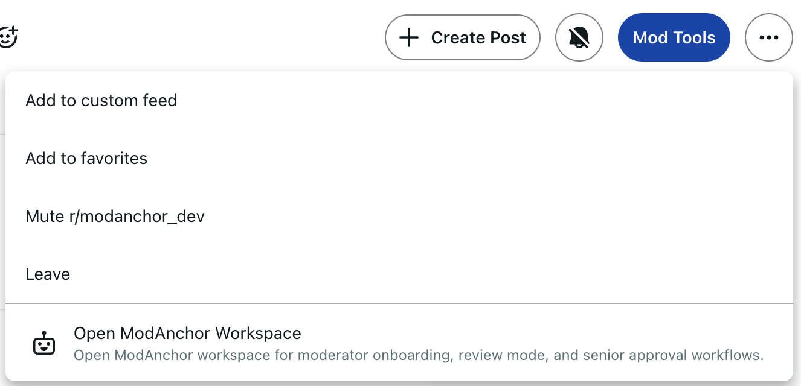
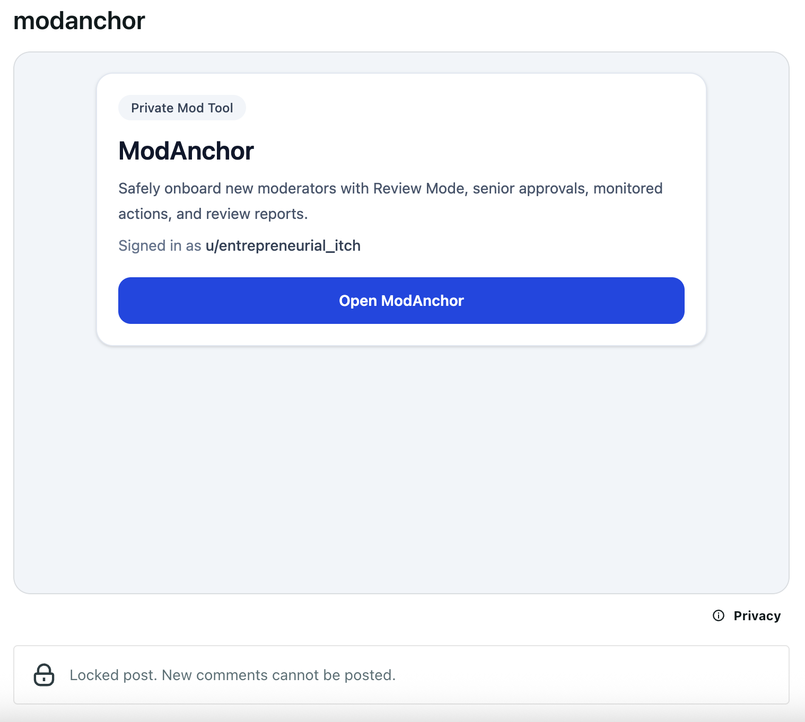
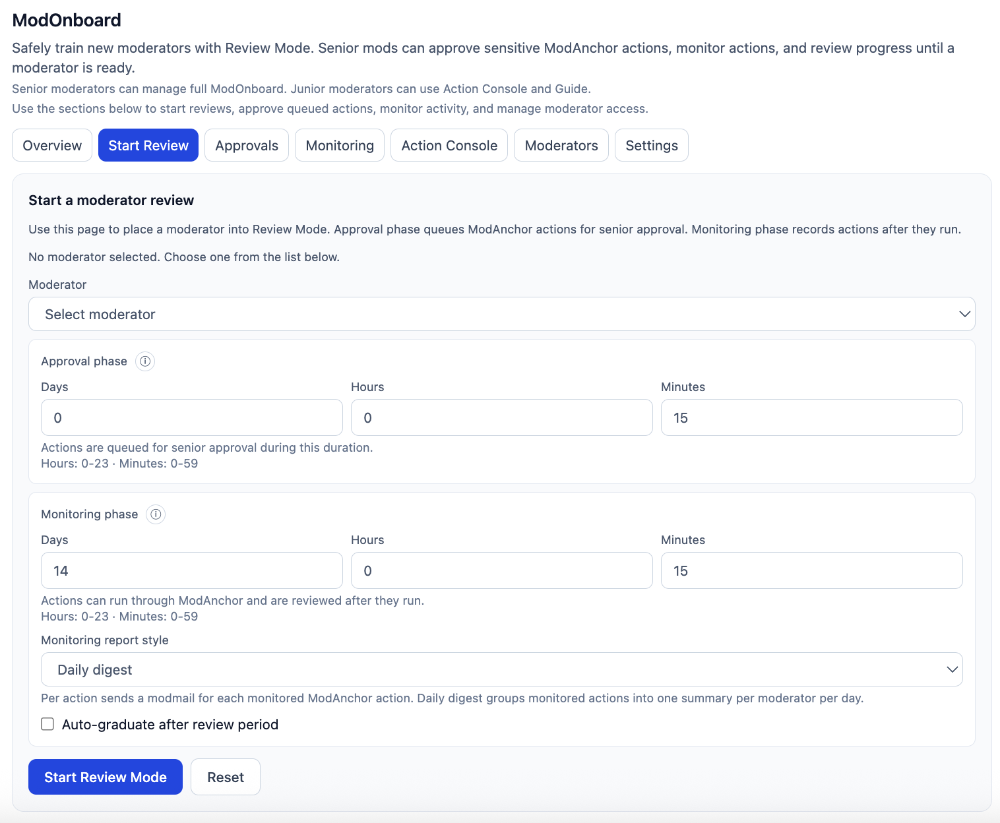
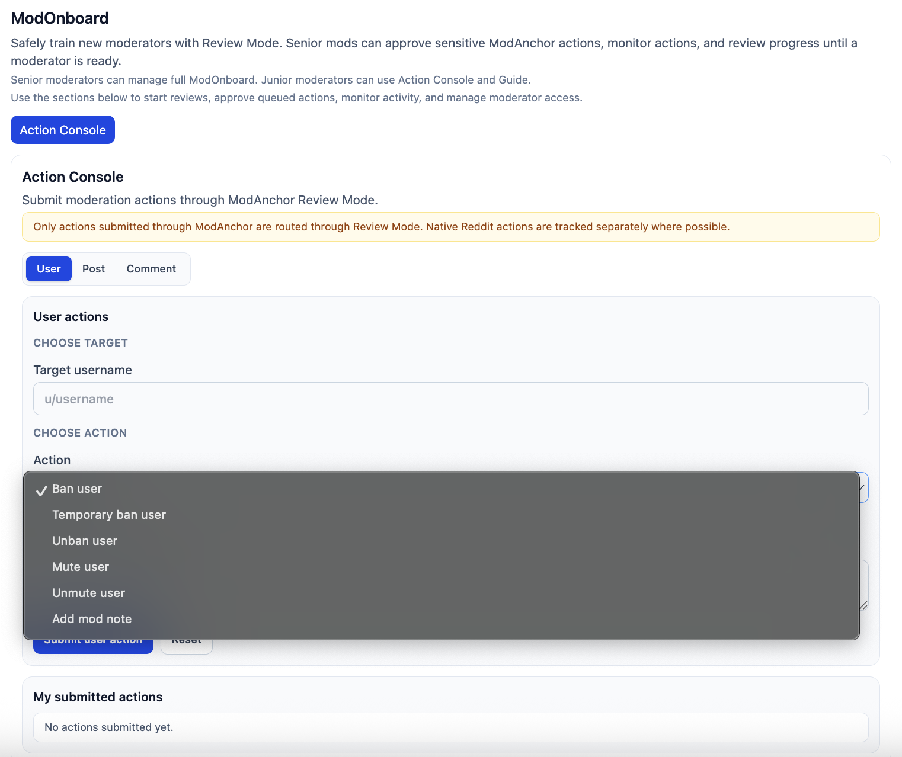
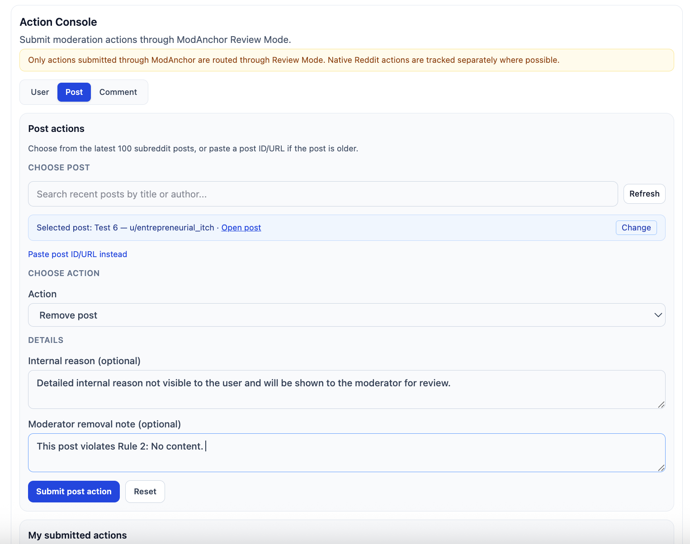
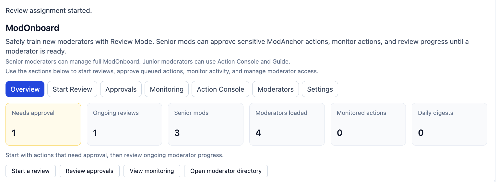
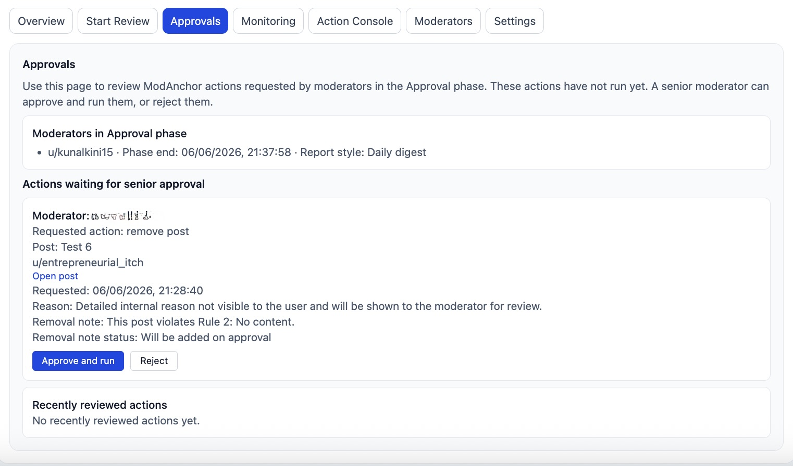
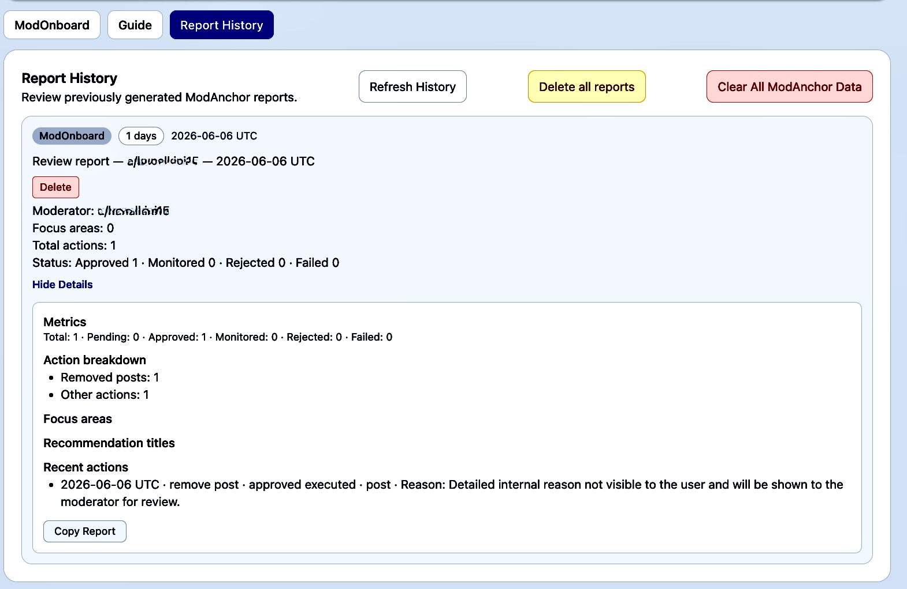

# ModAnchor

ModAnchor is a private workspace for onboarding new Reddit moderators safely.

Senior mods can place a new moderator into **Review Mode**. During review, actions can either wait for approval first or run normally while still being monitored.

It is not a replacement for Reddit’s mod tools. It is a review and coaching layer for mod teams.

---

## What ModAnchor helps with

- Start a review for a new moderator
- Queue actions for senior approval
- Monitor actions after they happen
- Review user, post, and comment actions
- Send daily digest or per-action updates
- Generate onboarding reports
- Keep review activity private from the public subreddit feed

---

## How to open ModAnchor

After installing the app:

1. Open your subreddit.
2. Open the subreddit menu or Mod Tools area.
3. Select **Open ModAnchor Workspace**.
4. Use the private ModAnchor workspace.

ModAnchor opens inside a Devvit custom post. The workspace post is locked and removed from the public feed.

---

## Review Flow

### 1. Open from the subreddit menu



### 2. Launch the private workspace



### 3. Start Review Mode



### 4. Submit actions through Action Console



### 5. Handle post actions



### 6. Track review progress



### 7. Approve or reject queued actions



### 8. Review action history



---

## Main tools

### ModOnboard

The senior moderator dashboard.

Use it to start reviews, check progress, move moderators between phases, complete reviews, and generate reports.

### Action Console

The place where moderators submit actions through ModAnchor.

Supported actions include:

- Ban or unban user
- Add mod note
- Mute or unmute user
- Approve, remove, spam, lock, or unlock posts
- Approve, remove, spam, lock, or unlock comments

Moderators can select recent posts/comments or paste a Reddit URL or ID manually.

### Approvals

Actions submitted during the approval phase appear here.

Senior mods can review the target, reason, and action before approving or rejecting it.

### Monitoring

Actions submitted during the monitoring phase run immediately, but they are still recorded for review.

Senior mods can check them later from the Monitoring tab, daily digest, or reports.

### Report History

Generated reports are saved here.

Reports summarize review activity, recent actions, action counts, and coaching notes.

---

## Review Mode

Review Mode has two phases.

### Approval phase

The junior moderator’s actions do not run immediately.

They wait for a senior mod to approve or reject them.

### Monitoring phase

The junior moderator’s actions run through ModAnchor immediately.

Senior mods can still review what happened afterward.

---

## Access

Senior moderators get the full workspace.

Moderators in active review get a smaller view focused on:

- Action Console
- Guide

Non-moderators should not be able to use the workspace.

---

## Permissions and limits

ModAnchor works with Reddit’s existing moderator permissions.

A junior moderator does not need full native moderation access to use Action Console.

Important limitation: ModAnchor does not block Reddit’s native moderation tools. If a moderator already has native Reddit permissions, they may still be able to act directly through Reddit.

ModAnchor also does not:

- Replace the mod queue
- Replace senior moderator judgment
- Automatically decide if someone is ready
- Publicly expose onboarding data
- Use LLMs in the current MVP

---

## Local development

```bash
npm run type-check
npm run lint
npm run build
````

For playtesting:

```bash
npx devvit playtest <subreddit_name>
```
